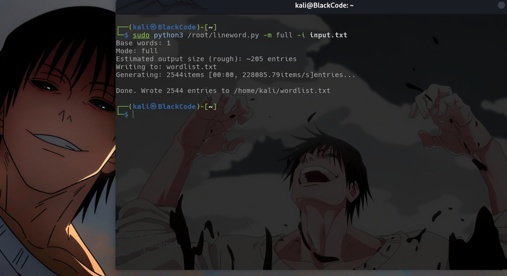
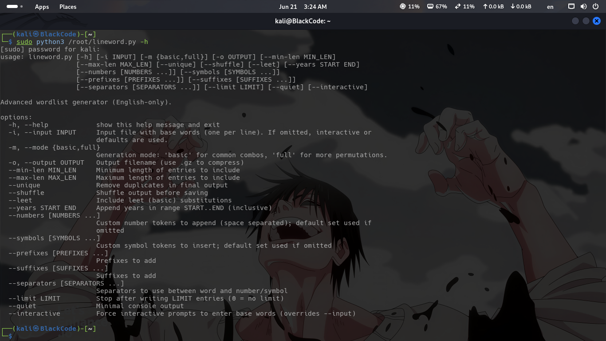
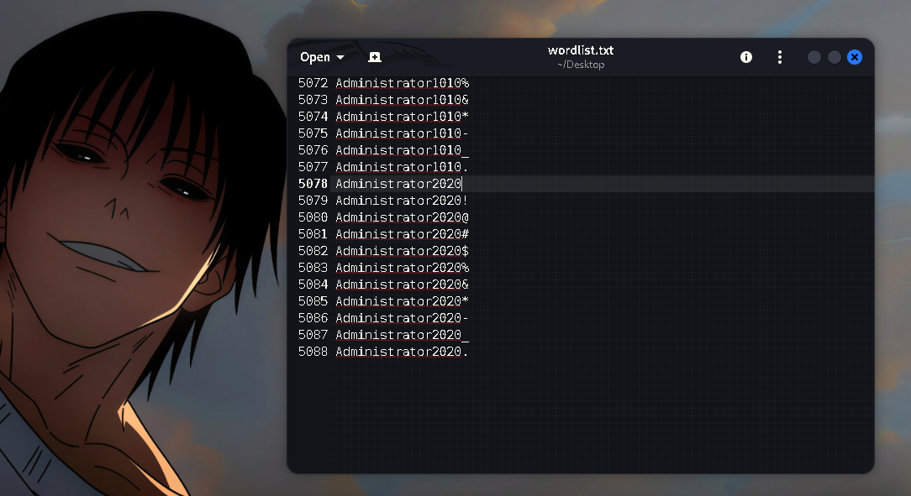

# ***LineWord create wordlis*** 
Professional and advanced custom text file creation tool with multiple options. You can use it quickly and without any problems.
This tool can create a custom list of words. You can give it a file that contains the words you want to create a list of words from. It will start creating the list of words file.

---
Create > input.txt (custom file): 

---
|Commands|Options|
|---|---|
|-h, --help|show this help message and exit|
|-i, --input (INPUT FILE)|Input file with base words (one per line). If omitted, interactive or defaults are used|
|-m, --mode {basic,full}|Generation mode: 'basic' for common combos, 'full' for more permutations|
|-o, --output OUTPUT|Output filename (use .gz to compress)|
|--min-len MIN_LEN|Minimum length of entries to include|
|--max-len MAX_LEN|Maximum length of entries to include|
|--unique|Remove duplicates in final output|
|--shuffle|Shuffle output before saving|
|--leet|Include leet (basic) substitutions|
|--years START END|Append years in range START..END (inclusive)|
|--numbers [NUMBERS ...]|Custom number tokens to append (space separated); default set used if omitted|
|--symbols [SYMBOLS ...]|Custom symbol tokens to insert; default set used if omitted|
|--prefixes [PREFIXES ...]|Prefixes to add|
|--suffixes [SUFFIXES ...]|Suffixes to add|
|--separators [SEPARATORS ...]|Separators to use between word and number/symbol|
|--limit LIMIT|Stop after writing LIMIT entries (0 = no limit)|
|--quiet Minimal|console output|
|--interactive|Force interactive prompts to enter base words (overrides --input)|

> You can follow our Telegram channel to get the latest updates on tools: https://t.me/ZeroBlackCode

***In the future, we will prepare a version that will receive the source for creating the file from an online server and will also handle over a hundred million lists.*** 
